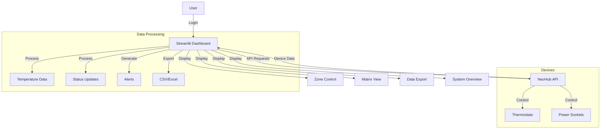
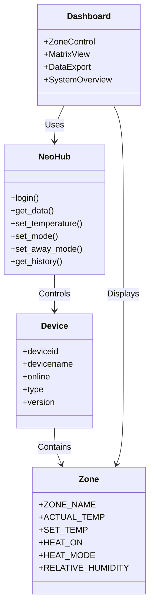
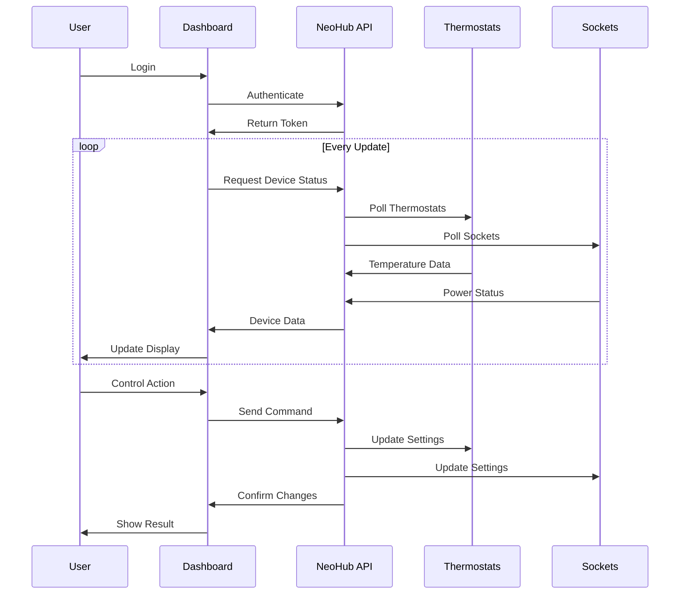

# NeoHub Control Dashboard

A Streamlit-based dashboard for monitoring and controlling NeoHub heating systems. This application provides a user-friendly interface for managing multiple NeoHub devices, zones, and power sockets.

## System Architecture



## Component Architecture



## Data Flow



## Features

- **Zone Control**
  - Temperature monitoring and control
  - Mode selection (Heat/Cool/Vent)
  - Real-time status updates
  - Support for both thermostats and power sockets

- **Matrix View**
  - Comprehensive overview of all zones
  - Status indicators for heating, windows, batteries
  - Customizable sorting and filtering
  - Export capabilities (CSV/Excel)

- **Data Export**
  - Detailed zone information
  - Multiple export formats
  - Customizable data selection

- **System Overview**
  - Device status monitoring
  - Temperature visualization
  - Problem detection and alerts
  - Performance metrics

## Installation

1. Clone the repository:
```bash
git clone https://github.com/GitDakky/NeoHub-Control.git
cd NeoHub-Control
```

2. Install dependencies:
```bash
pip install -r requirements.txt
```

## Usage

1. Run the Streamlit app:
```bash
streamlit run app.py
```

2. Open your browser and navigate to the provided URL (typically http://localhost:8501)

3. Log in with your NeoHub credentials

## Status Indicators

The dashboard uses the following indicators to show device status:

- 🔥 Heating active
- 🪟 Window open
- 🔋 Low battery
- ⚠️ Invalid reading
- ✓ Normal operation

## Device Types

The system supports two types of devices:

- **Thermostat**: Temperature control and monitoring
- **Socket**: Power socket control (no temperature readings)

## Requirements

- Python 3.8 or higher
- NeoHub account and devices
- Internet connection

## Contributing

1. Fork the repository
2. Create a feature branch
3. Commit your changes
4. Push to the branch
5. Create a Pull Request

## License

This project is licensed under the MIT License - see the LICENSE file for details.

## Author

DAK

## Acknowledgments

- NeoHub API
- Streamlit framework
- Python community
