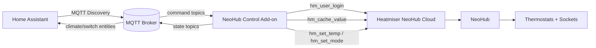

<p align="center">
  
</p>

<p align="center">
  <a href="https://github.com/GitDakky/NeoHub-Control"></a>
  
  
  
  
</p>

# NeoHub Control for Home Assistant

A standalone Home Assistant add-on repository for Heatmiser NeoHub heating systems.

NeoHub Control turns Heatmiser NeoHub into a proper Home Assistant citizen: cloud login, live zone telemetry, MQTT Discovery, thermostat control, socket control, diagnostic attributes, and a dashboard that looks like it belongs in a mission-control room rather than a boiler cupboard.

It uses the same NeoHub cloud method proven by the original Python project:

- `hm_user_login` for login and device discovery
- `hm_cache_value` for live heating state
- `hm_set_temp` for temperature commands
- `hm_set_mode` for mode and socket-style commands

The result: your Heatmiser estate becomes discoverable `climate.*` and `switch.*` entities in Home Assistant, ready for dashboards, automations, voice assistants, energy workflows, and sane operational visibility.

---

## Why this exists

Heating is infrastructure. It should be observable, scriptable, automatable, and beautiful.

NeoHub Control is for people who want more than a vendor app:

- Landlords and estate operators managing many heating zones
- Smart-home builders who want Home Assistant-native climate entities
- Engineers who want MQTT topics they can inspect, replay, automate, and trust
- Anyone who wants Heatmiser visibility without staring at a phone app

---

## Highlights

### Home Assistant add-on repository

- Add this repository directly to the Home Assistant Add-on Store
- Runs inside Home Assistant OS / Supervised as an add-on
- Uses MQTT Discovery to create Home Assistant entities automatically
- Uses pre-built GHCR images and Home Assistant builder actions for supported `aarch64` and `amd64` systems
- Reads configuration from the standard add-on `/data/options.json`
- Uses the Mosquitto add-on by default at `core-mosquitto:1883`

### HACS companion helper

- Provides a valid `custom_components/neohub_control` integration layout so HACS accepts the repository when users paste it there by mistake
- Shows the correct Add-on Store installation route from inside Home Assistant
- Does not replace the add-on runtime, because HACS does not run add-on containers

### Climate + socket entities

- Thermostat-like zones become MQTT `climate` entities
- Socket-like zones become MQTT `switch` entities
- Stable object IDs based on hub and zone name
- Retained availability, state, and discovery topics

### Real control path

Commands from Home Assistant are routed back to the NeoHub API:

- Set target temperature from Home Assistant
- Change mode: heat, cool, fan-only/vent, off
- Toggle socket-like zones through the mode command path

### Rich telemetry

The bridge publishes:

- Current temperature
- Target temperature
- HVAC mode
- Heating action
- Humidity
- Availability
- Window-open attribute
- Low-battery attribute
- Timer status
- Modulation level

### Premium dashboard included

This repository includes two dashboard templates:

- `dashboards/neohub-control-premium-dashboard.yaml`
  - Premium Home Assistant dashboard using Mushroom, Auto Entities, and ApexCharts
  - Auto-populates `climate.neohub_*` and `switch.neohub_*` entities
  - Includes a 24-hour temperature intelligence view

- `dashboards/neohub-control-basic-dashboard.yaml`
  - Zero-dependency Lovelace dashboard using only built-in cards
  - Good for clean installs or conservative systems

---

## Architecture


```mermaid
flowchart LR
    HA[Home Assistant] -->|MQTT Discovery| MQTT[(MQTT Broker)]
    MQTT -->|command topics| ADDON[NeoHub Control Add-on]
    ADDON -->|hm_user_login| CLOUD[Heatmiser NeoHub Cloud]
    ADDON -->|hm_cache_value| CLOUD
    ADDON -->|hm_set_temp / hm_set_mode| CLOUD
    CLOUD --> HUB[NeoHub]
    HUB --> ZONES[Thermostats + Sockets]
    ADDON -->|state topics| MQTT
    MQTT -->|climate/switch entities| HA
```

The add-on is intentionally MQTT-native. MQTT Discovery is the cleanest way for an add-on to create Home Assistant climate and switch entities without writing and maintaining a separate Home Assistant custom integration.

---

## Repository layout

```text
.
├── hacs.json                        # HACS custom repository metadata
├── custom_components/
│   └── neohub_control/              # HACS companion helper integration
├── repository.yaml                  # Home Assistant add-on repository manifest
├── addons/
│   └── neohub_control/              # Home Assistant add-on
│       ├── config.yaml              # Add-on manifest and options schema
│       ├── Dockerfile               # Add-on container image
│       ├── DOCS.md                  # Add-on documentation
│       ├── README.md                # Add-on store summary
│       ├── rootfs/                  # s6 service runner
│       └── app/                     # Code copied into the add-on image
├── assets/
│   └── neohub-control-hero.svg      # Animated project header
├── dashboards/
│   ├── neohub-control-premium-dashboard.yaml
│   └── neohub-control-basic-dashboard.yaml
├── ha_addon/                        # Testable add-on bridge source
├── neohub/                          # NeoHub API wrapper
├── tests/                           # MQTT bridge tests
└── requirements.txt                 # Local development requirements
```

---

## Installing in Home Assistant

### Important: HACS vs Add-on Store

NeoHub Control's working bridge runs as a Home Assistant add-on. HACS does not manage add-ons or add-on containers, so the functional installation path is the Home Assistant Add-on Store.

From `0.2.5`, this repository also includes a small HACS companion integration under `custom_components/neohub_control`. That makes the repository valid when it is pasted into HACS as an integration, but the HACS-installed helper only explains the correct add-on installation path inside Home Assistant. It does not run the NeoHub MQTT bridge.

Use the Add-on Store path below for the working bridge:

[](https://my.home-assistant.io/redirect/supervisor_add_addon_repository/?repository_url=https%3A%2F%2Fgithub.com%2FGitDakky%2FNeoHub-Control)

### 1. Add this repository

In Home Assistant:

1. Go to Settings → Add-ons → Add-on Store
2. Open the three-dot menu
3. Choose Repositories
4. Add:

```text
https://github.com/GitDakky/NeoHub-Control
```

5. Refresh the add-on store
6. Install `NeoHub Control`

### 2. Enable MQTT

Install and start the official Mosquitto broker add-on, then make sure the MQTT integration is enabled in Home Assistant.

From `0.2.4`, NeoHub Control explicitly declares minimal Supervisor API access and consumes Home Assistant Supervisor's `mqtt:need` service credentials automatically. Leave the MQTT username/password blank unless you intentionally use an external broker. This fixes the common failure where Mosquitto rejects anonymous add-on clients and no discovery entities appear.

### 3. Configure NeoHub credentials and building mapping

```yaml
username: your-neohub-email@example.com
password: your-neohub-password
url: https://neohub.co.uk/
poll_interval: 60
discovery_prefix: homeassistant
base_topic: neohub
property_name: Example House

# Assign each physical hub to a building/property zone.
hub_zones:
  - hub_name: Gate House
    zone: Gate House
  - hub_name: 2nd Floor
    zone: Upper Floor

# Assign thermostat points to rooms. `zone` can override the hub zone.
room_mappings:
  - hub_name: Gate House
    thermostat: Kitchen
    room: Kitchen
    zone: Gate House
  - hub_name: 2nd Floor
    thermostat: G Ensuite
    room: Green Ensuite
    zone: Upper Floor

mqtt:
  host: ""
  port: 1883
  username: ""
  password: ""
  ssl: false
```

Start the add-on. Within one poll cycle, Home Assistant should discover entities like:

```text
climate.neohub_main_hub_kitchen_ufh_hub_1
sensor.neohub_main_hub_kitchen_ufh_hub_1_floor_temperature
binary_sensor.neohub_main_hub_kitchen_ufh_hub_1_window_open
switch.neohub_main_hub_garden_socket_hub_1
```

---

## Dashboard setup

### Premium dashboard

Use this if you want the full visual experience:

```text
dashboards/neohub-control-premium-dashboard.yaml
```

Recommended optional frontend cards, commonly installed through HACS:

- Mushroom Cards
- Auto Entities
- ApexCharts Card
- Optional: Card Mod for the glassmorphism hero card styling

The premium dashboard auto-discovers entities matching:

```text
climate.neohub_*
switch.neohub_*
sensor.neohub_*
binary_sensor.neohub_*
```

### Basic dashboard

Use this if you want no custom frontend dependencies:

```text
dashboards/neohub-control-basic-dashboard.yaml
```

Edit the example entity IDs to match your actual discovered entities.

---

## MQTT topic model

For a hub called `Main Hub`, hub ID `hub-1`, and a zone called `Kitchen UFH`, the bridge creates an object ID like:

```text
neohub_main_hub_kitchen_ufh_hub_1
```

Discovery:

```text
homeassistant/climate/neohub_main_hub_kitchen_ufh_hub_1/config
```

State:

```text
neohub/neohub_main_hub_kitchen_ufh_hub_1/availability
neohub/neohub_main_hub_kitchen_ufh_hub_1/current_temperature
neohub/neohub_main_hub_kitchen_ufh_hub_1/target_temperature
neohub/neohub_main_hub_kitchen_ufh_hub_1/mode
neohub/neohub_main_hub_kitchen_ufh_hub_1/action
neohub/neohub_main_hub_kitchen_ufh_hub_1/humidity
neohub/neohub_main_hub_kitchen_ufh_hub_1/floor_temperature
neohub/neohub_main_hub_kitchen_ufh_hub_1/modulation_level
neohub/neohub_main_hub_kitchen_ufh_hub_1/attributes
```

Commands:

```text
neohub/neohub_main_hub_kitchen_ufh_hub_1/set_temperature
neohub/neohub_main_hub_kitchen_ufh_hub_1/set_mode
```

---

## Development

Install local development dependencies:

```bash
python3 -m venv .venv
source .venv/bin/activate
pip install -r requirements.txt
```

Run tests:

```bash
PYTHONPATH=. pytest -q
```

Run the add-on bridge tests against the packaged add-on copy:

```bash
PYTHONPATH=addons/neohub_control/app pytest tests/test_ha_mqtt.py -q
```

Run lint:

```bash
ruff check .
```

Build and publish flow:

- Pull requests run the Home Assistant builder workflow without publishing images.
- Pushes to `master` publish `ghcr.io/gitdakky/neohub-control:<version>` and `latest` multi-architecture images.
- `addons/neohub_control/config.yaml` points Home Assistant at the pre-built GHCR image, which avoids slow and fragile local builds on Home Assistant hosts.

---

## Current status

Working and tested locally:

- MQTT discovery payload generation
- Climate state publishing
- Socket state publishing
- Command topic routing
- Temperature command validation
- Python compile checks
- Ruff lint checks
- YAML parsing checks

Needs real-world validation:

- Live NeoHub account/device test
- Home Assistant add-on store install flow
- Live Home Assistant install/update through the GHCR image published by CI
- Long-running MQTT reconnect behaviour under broker/cloud outages

---

## Neostat WiFi note

This project is designed for NeoHub-backed devices. A reported Neostat WiFi case can read data but receives an HTML redirect when attempting control endpoints such as `hm_set_temp`. That likely needs a separate Neostat WiFi control strategy rather than the NeoHub control path.

---

## Security and privacy

- Credentials are read from Home Assistant add-on options.
- Credentials are not published to MQTT.
- MQTT discovery/state topics contain hub and zone names; choose zone names accordingly if topic visibility matters in your network.
- Use a trusted MQTT broker and avoid exposing it directly to the internet.

---

## Contributing

Pull requests are welcome.

Good first contributions:

- Confirm live device compatibility
- Add reconnect/backoff hardening
- Improve socket-specific control semantics
- Add optional sensors for diagnostics
- Add Home Assistant screenshots
- Package releases and SLSA provenance for real build artifacts

Please include tests for behavior changes where practical.

---

## License

MIT. See `LICENSE`.

---

## Acknowledgments

Built for the Home Assistant and Heatmiser communities, with respect for people who believe their heating system should be as observable and automatable as the rest of their infrastructure.
